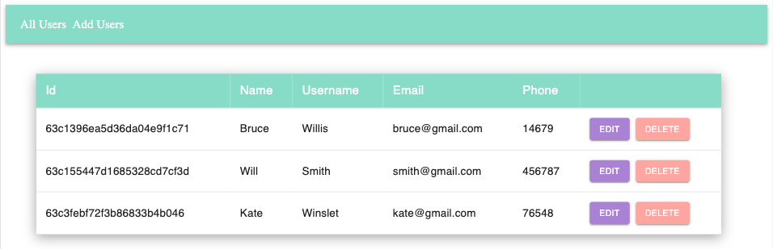
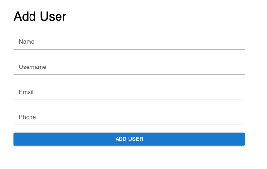

# Users_Management

## Crud Application to test:
* Create
* Reade
* Update
* Delete

## API endpoints:
http://localhost:3001/

## Front end:
* React
* Styled component 

## Back end
* MongoDB
* Node.js
